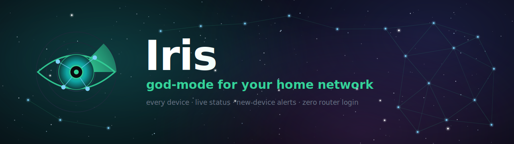

<div align="center">



# ✦ Polaris

**See every device on your home network, and what each one is exposing.**

No router login. No agents. No cloud. Runs on your Mac.


</div>

---

## Why

Your router lists what is connected. Polaris tells you what each device is
*doing*: which ports it has open, whether that is risky, and when something new
shows up. History stays local. Alerts go to your phone.

Real findings from one evening on an ordinary home network: a router with UPnP
open to the LAN, a printer accepting unauthenticated print jobs, and a laptop
nobody remembered connecting.

## Install

```bash
npm install
npm run build
./polaris install     # auto-start at login
```

Open **http://localhost:4000**.

## Use

```bash
./polaris            # is it running?
./polaris start / stop / restart
./polaris rebuild    # build, then restart
./polaris logs
```

That is the whole interface.

## What it does

- **Finds everything.** ARP-first sweep, no `sudo`, a /22 in about 2.5 seconds.
  Catches devices that ignore pings, which a ping sweep misses entirely.
- **Names them.** mDNS service discovery, `.local` names, NetBIOS, reverse DNS,
  and a bundled offline database of 40,000 MAC vendor prefixes.
- **Scans for exposure.** Opt-in `nmap` per device. Flags SMB, RDP, Telnet, VNC,
  UPnP and friends. Says "unconfirmed" when it is guessing instead of inventing a
  service name from a port number.
- **Alerts you.** ntfy push when an unknown device joins, including what it has
  open. A heartbeat every 7 days, so silence means something is wrong.
- **Maps it.** Live topology grouped by trust or device type, firewall boundary
  drawn in, exposure badges on each node.
- **Remembers.** SQLite history that survives restarts.

## Requirements

- macOS
- Node.js 20+
- `nmap` for port scanning: `brew install nmap`. Everything else works without it.

## Privacy

- The API binds to `127.0.0.1`. It is not reachable from your LAN.
- Rejects non-loopback `Host` headers (DNS-rebinding defense) and cross-site
  POSTs (CSRF). Both tested end-to-end against a running server.
- **The only outbound request Polaris ever makes is the ntfy push you
  configure.** Vendor lookups are offline. No telemetry, no cloud, no
  third-party services.
- Your device database stays in `data/`, which is git-ignored.

## Notifications

```bash
# .env
NTFY_URL=https://ntfy.sh/polaris-home-CHANGE-ME-8fk39dk2mx7
```

Use a long, unguessable topic: anyone who knows a public ntfy topic can read it.
Subscribe in the ntfy app, then click **alerts on** to send a test.

Having people over? **Guest mode** mutes new-device pushes for 4 hours. Visitors'
phones use randomized MACs, so they look like a new device every visit.

## Configuration

All optional. See [`.env.example`](./.env.example) for the full list.

| Env var | Default | Meaning |
| --- | --- | --- |
| `SCAN_INTERVAL_MS` | `300000` | scan every 5 minutes (min 10000) |
| `EVENT_RETENTION` | `5000` | activity rows kept, roughly 25 days |
| `HEARTBEAT_DAYS` | `7` | "still running" push, 0 to disable |
| `NTFY_URL` | unset | ntfy topic, unset means alerts off |
| `AUTOSCAN_NEW_DEVICES` | `1` | port-scan new arrivals |
| `ISP_NAME` | `Internet / ISP` | label for the upstream map node |

## Development

```bash
npm run dev     # API on :4000, dashboard on :5173, hot reload
npm test        # server (node:test) + web (vitest)
```

```
server/   Node + TypeScript
  net/    discovery, mDNS, NetBIOS, vendors, port scanning
  db.ts   SQLite: devices, events, scan diffing
  *.test.ts
web/      Vite + React 19 + Tailwind v4
polaris   the one control script
```

Runs as a macOS LaunchAgent: one Node process, about 77MB.

## Troubleshooting

**Stopped working after a Node upgrade.** The SQLite driver is a native module
and a major Node bump invalidates it:

```bash
npm rebuild better-sqlite3 && ./polaris restart
```

**A device is missing.** It may be on your guest network, a separate isolated
subnet that Polaris cannot see. That is the guest network working.

**Nothing on the map.** Offline devices are hidden by default. Click
**show offline**.

## License

MIT
